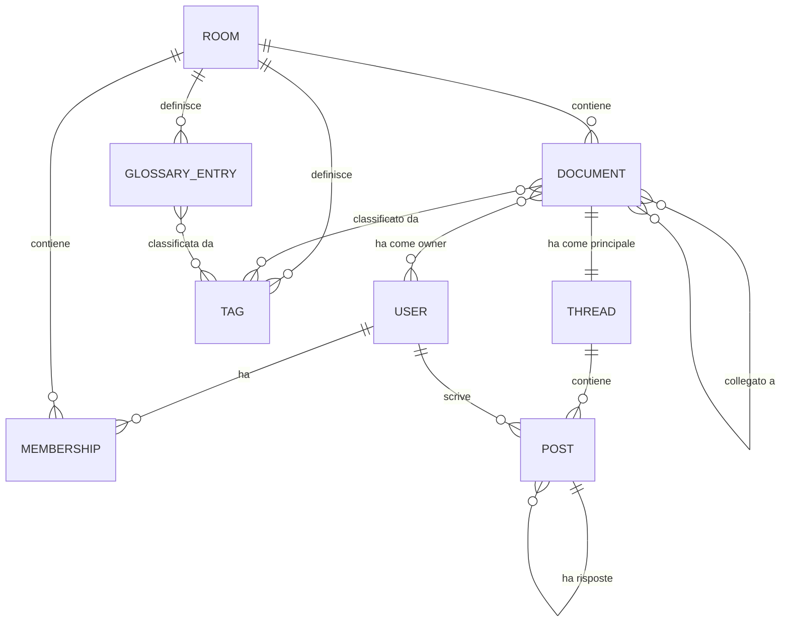

# Piattaforma collaborativa di note per TTRPG — Analisi dei requisiti

| | |
|---|---|
| **Versione** | 0.3 (bozza) |
| **Data** | 21 settembre 2026 |
| **Stato** | In definizione: requisiti, use case, feature e workflow |
| **Destinatari** | Team di progetto e Agent che useranno questo documento come Context di base |

**Novità della 0.2:** risolti i Punti aperti OQ-01…OQ-08 (ora Decisioni D-11…D-18); introdotto il ruolo Amministratore; i "campi" dei Documento sono ora Dettagli nel Thread principale; il Glossario è filtrabile per Tag; nuovi Punti aperti OQ-09…OQ-12.

**Novità della 0.3:** risolti i Punti aperti OQ-11 e OQ-12 (ora Decisioni D-19, D-20), in preparazione all'unità Documenti/Dettagli. OQ-09 e OQ-10 restano formalmente aperti ma sono già implementati nella pratica dall'unità Rooms/Membership (vedi `progress-tracker.md`).

---

## 1. Scopo del documento

Questo documento è la guideline di base del progetto. Serve a:

1. fissare requisiti, use case, feature e workflow prima dell'implementazione;
2. fornire un **Context stabile e non ambiguo** agli Agent che lavoreranno sulle implementazioni successive.

**Convenzioni di lettura**

- Ogni elemento ha un **ID stabile** (`D-` decisioni, `OQ-` punti aperti, `VR-` regole di visibilità, `FR-` requisiti funzionali, `NFR-` non funzionali, `UC-` use case, `W-` workflow, `I-` invarianti). Riferirsi sempre agli ID, non a parafrasi.
- I termini con l'iniziale maiuscola sono definiti nel Glossario (sezione 3) e vanno usati con quel significato.
- Ciò che non è nelle Decisioni (sezione 5) è una **proposta**, non una scelta confermata.

---

## 2. Visione e scope

Una web application distribuita online in cui più User contribuiscono alla documentazione e alle note di una campagna di un qualsiasi TTRPG (sistema di gioco agnostico).

**Obiettivi**

- Raccogliere in un unico posto le informazioni di una campagna (luoghi, NPC, eventi, artefatti e altro).
- Permettere conversazioni contestuali sui contenuti tramite Thread.
- Controllare con precisione chi vede cosa (segreti del Master, informazioni dei singoli Player).
- Produrre una base di conoscenza strutturata, utilizzabile anche da Agent.

**Fuori scope per ora**

- Editing collaborativo in tempo reale (D-04).
- Gestione di regole, schede personaggio, dadi, mappe o combattimento.
- App mobile nativa (l'interfaccia web deve però essere usabile da smartphone).

---

## 3. Glossario

| Termine | Definizione |
|---|---|
| **User** | Persona autenticata sulla piattaforma (login con Google). |
| **Stanza** | Contenitore di una campagna: ha membri, Documenti, Tag, Glossario. |
| **Membership** | Legame tra un User e una Stanza, con i suoi ruoli in quella Stanza. |
| **Master** | Ruolo di un User in una specifica Stanza, con Ownership completa sui contenuti. |
| **Player** | Ruolo di un User in una specifica Stanza, con contributi e visibilità propri. |
| **Amministratore** | Ruolo di gestione della Stanza (membri, ruoli, inviti). Assegnato di base al creatore; più User possono averlo (D-11). |
| **Documento** | Unità di conoscenza di una Stanza (luogo, NPC, evento, artefatto, ecc.). Non ha un tipo rigido (D-05). |
| **Tag** | Etichetta per classificare e navigare Documenti e voci di Glossario. I "tipi" sono Tag (D-05). |
| **Glossario** (o Dizionario) | Insieme di voci (termine + definizione) della Stanza, filtrabile per Tag (D-14). |
| **Thread** | Conversazione legata a un Documento, composta da Post annidati. Ogni Documento ha un Thread principale. |
| **Post** | Singolo contributo in un Thread. Può essere un **Commento** o un **Dettaglio**. |
| **Dettaglio** | Ulteriore Descrizione titolata aggiunta al Thread principale di un Documento (es. "Segni Particolari: ha una gamba di legno che scricchiola ad ogni passo") (D-18). |
| **Ownership (di un Documento)** | Diritto di modificare il Documento e gestirne la visibilità. Riattribuibile (D-12). |
| **Visibilità** | Insieme di User che possono vedere un contenuto. |
| **Rivela** | Azione che amplia la visibilità di un contenuto, con tracciamento. |
| **Agent** | Consumatore automatico di contesto che opera con i permessi dell'User per cui agisce. |

---

## 4. Attori e ruoli

| Attore | Descrizione |
|---|---|
| Visitatore | Non autenticato. Vede solo la pagina di login. |
| User | Autenticato. Può creare Stanze e ricevere inviti. |
| Amministratore | Ruolo per Stanza. Gestisce membri, ruoli e inviti. Assegnato di base al creatore; più Amministratori possibili (D-11). |
| Master | Ruolo per Stanza. Ownership completa sui contenuti, vede ogni contenuto della Stanza. |
| Player | Ruolo per Stanza. Contribuisce e gestisce la visibilità dei propri contenuti. |
| Agent (futuro) | Opera con lo scope di un User. |

**I ruoli dipendono dalla Stanza** (D-06): lo stesso User può essere Master in una Stanza e Player in un'altra.

*Assunzione (OQ-09):* l'Amministratore è **cumulabile** con Master o Player: un User ha sempre almeno un ruolo narrativo (Master o Player) e può in più essere Amministratore. Il creatore di una Stanza parte come Amministratore e Master.

---

## 5. Decisioni prese

| ID | Decisione |
|---|---|
| D-01 | Il **Master vede anche i contenuti privati dei Player**. Commenti privati al 100% (Master incluso, "contenuti sigillati") sono un'evoluzione possibile ma non prioritaria. |
| D-02 | Una Stanza può avere **più Master (co-GM)**, non prioritario. Serve un sistema generale di gestione delle Stanze: User Amministratori, ruoli modificabili, User che entrano o vengono invitati. |
| D-03 | La **descrizione di un Documento** la modifica **chiunque abbia Ownership** su quel Documento. |
| D-04 | **Nessun editing real-time** per ora. Priorità a una **struttura di Thread efficiente**. |
| D-05 | I Documenti **non sono strettamente tipizzati**: i "Tipi" (NPC, Luogo, Evento, Artefatto…) sono assimilabili ai **Tag**. |
| D-06 | I ruoli (Master/Player/Amministratore) sono **per Stanza**, non globali. |
| D-07 | Login tramite **Google** (modalità preferita). |
| D-08 | Ogni **Player è Owner della visibilità dei propri contenuti** rispetto agli altri Player. Il **Master ha Ownership completa** sul progetto (Stanza). |
| D-09 | Ogni Documento può avere Nome, Immagine, descrizione, Tag e ulteriori dettagli (definiti in D-18). |
| D-10 | Contenuti, singoli commenti e altre informazioni possono essere **nascosti a User diversi**. |
| D-11 | L'**Amministratore è un ruolo terzo**, assegnato di base al creatore della Stanza. **Più User possono essere Amministratori contemporaneamente.** *(risolve OQ-01)* |
| D-12 | **Ownership dei Documenti:** il creatore è Owner di default; Master e Owner possono aggiungere o rimuovere Owner (l'Ownership può essere riattribuita ad altri). Il **Master ha sempre Ownership implicita**. *(risolve OQ-02)* |
| D-13 | I **Player possono creare Documenti** di default; l'opzione è disattivabile per Stanza dal Master. *(risolve OQ-03)* |
| D-14 | **Tag con categoria opzionale** (es. "Tipo", "Fazione"); Tag di default (NPC, Luogo, Evento, Artefatto) creati con la Stanza e modificabili. Il **Glossario/Dizionario è filtrabile per uno o più Tag**. *(risolve OQ-04)* |
| D-15 | I **contenuti di un User che esce o viene rimosso restano visibili, salvo eliminazione**. L'Ownership dei suoi Documenti può essere riattribuita; il Master ha comunque Ownership implicita. *(risolve OQ-05)* |
| D-16 | L'**Amministratore può designare un nuovo Master**. **L'ultimo Amministratore non può uscire** dalla Stanza senza aver designato un nuovo Amministratore. *(risolve OQ-06)* |
| D-17 | Una **risposta a un Post non può essere più visibile del Post padre**. *(risolve OQ-07)* |
| D-18 | I **dettagli di un Documento** sono **ulteriori Descrizioni (Dettagli) aggiunte al Thread principale** del Documento, ciascuna con titolo e contenuto. Non esistono campi custom strutturati. *(risolve OQ-08)* |
| D-19 | Un **Dettaglio** può essere aggiunto da **qualsiasi membro che veda il Documento** (non solo dagli Owner). È un **Post di primo livello con titolo**, pubblicato nel Thread principale, con **visibilità propria** (come ogni Post, sezione 8) e **risposte annidate**. È **modificabile dall'autore e dal Master** (non da un Owner che non sia anche una di queste due figure). Un **Owner può promuoverlo** nella descrizione del Documento (FR-T8). *(risolve OQ-11)* |
| D-20 | **Un solo Thread principale per Documento**: nessun Thread aggiuntivo nella v1. *(risolve OQ-12)* |

---

## 6. Punti aperti

| ID | Domanda | Proposta di lavoro |
|---|---|---|
| OQ-09 | L'**Amministratore è cumulabile** con Master/Player? Come si dividono i poteri tra Amministratore e Master (eliminare/archiviare la Stanza, designare Amministratori)? | Cumulabile. **Amministratore** = gestione della Stanza (membri, ruoli, inviti, archiviazione/eliminazione, designazione di Master e Amministratori). **Master** = poteri sui contenuti (D-08). Un Amministratore non-Master non ha visibilità aggiuntiva sui contenuti. Il creatore parte come Amministratore + Master. |
| OQ-10 | Una Stanza può restare **senza Master**? | No: l'ultimo Master non può uscire né essere retrocesso senza un sostituto; l'Amministratore può designarne uno (D-16). |

**Storico dei Punti aperti risolti:** OQ-01 → D-11 · OQ-02 → D-12 · OQ-03 → D-13 · OQ-04 → D-14 · OQ-05 → D-15 · OQ-06 → D-16 · OQ-07 → D-17 · OQ-08 → D-18 · OQ-11 → D-19 · OQ-12 → D-20.

*Nota: OQ-09 e OQ-10 restano qui perché non hanno ancora un ID `D-` formale, ma le loro proposte di lavoro sono già implementate (vedi `progress-tracker.md`, unità Rooms/Membership) — non sono bloccanti per le unità successive.*

---

## 7. Modello di dominio

**Note sul modello**

- `MEMBERSHIP` contiene i **ruoli** dell'User nella Stanza: Master o Player, più l'eventuale Amministratore (D-06, D-11). È ciò che rende il ruolo dipendente dalla Stanza.
- `DOCUMENT` **non ha un campo "tipo"**: la classificazione avviene tramite `TAG` (D-05).
- `DOCUMENT` **non ha campi custom**: le informazioni aggiuntive sono `POST` di tipo **Dettaglio** nel Thread principale (D-18).
- Ogni contenuto visibile (Documento, blocco di informazione, Post, voce di Glossario) ha una **regola di Visibilità** associata.
- `DOCUMENT` ↔ `USER` (owner) rappresenta la **Ownership** (D-03, D-12).

**Entità principali e attributi indicativi**

- **User:** id, identità Google (nome, avatar).
- **Room:** id, nome, descrizione, sistema di gioco (testo libero), stato (attiva/archiviata).
- **Membership:** user, room, ruolo narrativo (Master/Player), flag Amministratore, data di ingresso.
- **Document:** id, nome, immagine, descrizione, Tag, Owner, visibilità, cronologia versioni; Thread principale.
- **Tag:** nome, categoria opzionale, Stanza.
- **GlossaryEntry:** termine, definizione, Tag, visibilità, Stanza.
- **Thread:** Documento di appartenenza; contiene i Post.
- **Post:** autore, tipo (Commento | Dettaglio), titolo (solo Dettaglio), contenuto, Post padre, visibilità, stato, timestamp.
- **Invitation:** Stanza, codice/link, ruolo proposto, scadenza, stato.
- **AuditLog:** chi, cosa, quando (modifiche di visibilità, ruoli, Ownership, Rivela).

---

## 8. Modello di Visibilità

**Livelli**

| Livello | Chi vede |
|---|---|
| Stanza | Tutti i membri della Stanza |
| Solo Master | Solo i Master |
| Privato | L'autore/Owner e il Master |
| Selettivo | Autore/Owner, Master e una lista di User scelti |

**Regole**

| ID | Regola |
|---|---|
| VR-01 | Il **Master vede ogni contenuto** della Stanza, indipendentemente dal livello (D-01). |
| VR-02 | Un **Player decide la visibilità dei propri contenuti** rispetto agli altri Player (D-08). |
| VR-03 | La visibilità è applicabile a **Documento, blocco di un Documento, Post (Commenti e Dettagli)** (D-10). |
| VR-04 | Una **risposta non può essere più visibile del Post padre** (D-17). |
| VR-05 | Ogni Stanza definisce una **visibilità di default** per i nuovi contenuti. |
| VR-06 | **Rivela** amplia la visibilità e viene registrata (chi, quando, da/verso quale livello). |
| VR-07 | Il filtro di visibilità è applicato **lato server** a ogni punto di uscita: liste, ricerca, filtri per Tag, Glossario, conteggi (anche dei Tag), backlink, notifiche, immagini, export, API e contesto per Agent. |
| VR-08 | Ogni modifica di visibilità è tracciata nell'AuditLog. |
| VR-09 | *(evoluzione, non prioritaria)* Contenuti **sigillati**: privati anche al Master (D-01). |
| VR-10 | *(proposta)* Le **voci di Glossario** sono contenuti con visibilità, per evitare che rivelino informazioni nascoste. |
| VR-11 | I contenuti di un User che esce restano soggetti alla visibilità impostata (D-15). |

---

## 9. Ownership e permessi

**Ownership di un Documento (D-12):** il creatore è Owner di default. Master e Owner possono aggiungere o rimuovere Owner. Il Master è sempre Owner implicito. Chi non è Owner contribuisce tramite Thread (Commenti e Dettagli).

**Come leggere la matrice:** la colonna Amministratore mostra solo i **poteri di gestione della Stanza**. I poteri sui contenuti derivano dal ruolo narrativo (Master/Player) e dall'Ownership (OQ-09).

| Azione | Amministratore | Master | Owner del Documento | Altri membri | Non membro |
|---|---|---|---|---|---|
| Modificare/archiviare/eliminare la Stanza | ✅ | ❌ | — | ❌ | ❌ |
| Invitare, rimuovere membri, cambiare ruoli, designare Master e Amministratori | ✅ | ❌ | — | ❌ | ❌ |
| Creare Documenti | — | ✅ | — | ✅ (D-13) | ❌ |
| Modificare la descrizione di un Documento | — | ✅ | ✅ | ❌ | ❌ |
| Riattribuire l'Ownership | — | ✅ | ✅ | ❌ | ❌ |
| Gestire Tag e Glossario | ✅ | ✅ | ❌ | ❌ | ❌ |
| Postare Commenti e aggiungere Dettagli (dove visibili) | — | ✅ | ✅ | ✅ | ❌ |
| Impostare la visibilità dei propri contenuti | — | ✅ | ✅ | ✅ | ❌ |
| Vedere contenuti altrui non pubblici | ❌ | ✅ | Solo se ammesso | Solo se ammesso | ❌ |
| Moderare o eliminare Post altrui | — | ✅ | ❌ | ❌ | ❌ |
| Rivelare contenuti altrui | — | ✅ | ❌ | ❌ | ❌ |

*La matrice è una proposta da validare insieme a OQ-09; la parte sui Dettagli è ora confermata da D-19.*

---

## 10. Requisiti funzionali

### Autenticazione
- **FR-A1** Login con Google (OAuth).
- **FR-A2** Profilo base (nome, avatar) e logout.

### Stanze e membri
- **FR-R1** Creare, modificare, archiviare ed eliminare una Stanza. Chi crea la Stanza diventa Amministratore (D-11) e Master (OQ-09).
- **FR-R2** Invitare tramite link o codice, con scadenza e revoca.
- **FR-R3** Accettare un invito ed entrare con il ruolo proposto.
- **FR-R4** Gestire i membri: cambiare ruoli, assegnare il ruolo Amministratore a più User, rimuovere, uscire (D-02, D-11).
- **FR-R5** Designare un nuovo Master (D-16). Più Master contemporanei (co-GM) sono possibili ma non prioritari (D-02).
- **FR-R6** Elenco delle proprie Stanze con i ruoli in ciascuna.
- **FR-R7** L'ultimo Amministratore non può uscire senza aver designato un nuovo Amministratore (D-16).
- **FR-R8** Alla rimozione o uscita di un User, i suoi contenuti restano visibili salvo eliminazione, e l'Ownership dei suoi Documenti è riattribuibile (D-15).

### Documenti
- **FR-D1** CRUD Documento con nome, immagine, descrizione (rich text o Markdown), Tag.
- **FR-D2** Gestione e riattribuzione dell'Ownership del Documento (D-12).
- **FR-D3** Aggiungere **Dettagli** (ulteriori Descrizioni titolate) al Thread principale del Documento (D-18, D-19).
- **FR-D4** Collegamenti tra Documenti tramite menzione, con backlink.
- **FR-D5** Cronologia delle modifiche con ripristino.
- **FR-D6** Stato bozza/pubblicato.
- **FR-D7** Opzione per Stanza che abilita/disabilita la creazione di Documenti da parte dei Player (D-13).

### Tag, Glossario e navigazione
- **FR-N1** Tag per Stanza, con categoria opzionale e Tag di default alla creazione (D-14).
- **FR-N2** Filtro dei Documenti per uno o più Tag (combinabili) e navigazione per categoria.
- **FR-N3** Glossario con voci, definizioni, Tag e link ai Documenti correlati.
- **FR-N4** **Filtro del Glossario/Dizionario per uno o più Tag** (D-14).
- **FR-N5** Ricerca full-text su Documenti, Post e Glossario, sempre filtrata per visibilità.
- **FR-N6** Riconoscimento dei termini del Glossario nel testo (Could).

### Thread
- **FR-T1** Ogni Documento ha un Thread principale; si aggiungono Commenti e Dettagli come Post, con risposte annidate.
- **FR-T2** Profondità di annidamento limitata (proposta: 3–4 livelli, poi appiattimento) per mantenere la leggibilità.
- **FR-T3** Ordinamento (cronologico, ultima attività) e caricamento progressivo/paginato.
- **FR-T4** Comprimere/espandere rami; indicatore di contenuti non letti.
- **FR-T5** Modificare ed eliminare i propri Post (eliminazione con segnaposto per non spezzare la conversazione); il Master può moderare.
- **FR-T6** Menzioni @User e reazioni.
- **FR-T7** Fissare un Post in evidenza e segnare una discussione come risolta.
- **FR-T8** **Promuovere** un Post o un Dettaglio a contenuto della descrizione del Documento (o a nuovo Documento), da parte di un Owner.
- **FR-T9** Notifiche in-app (email in seguito).
- **FR-T10** I Dettagli sono mostrati nella scheda del Documento come sezione dedicata, filtrata per visibilità.

### Visibilità
- **FR-V1** Impostare la visibilità su Documento, blocco e Post (VR-03).
- **FR-V2** Azione **Rivela** con tracciamento (VR-06).
- **FR-V3** Anteprima "vedi come User X" per il Master.
- **FR-V4** Filtro di visibilità lato server su ogni query (VR-07).
- **FR-V5** Cronologia delle modifiche di visibilità (VR-08).
- **FR-V6** Una risposta non può avere visibilità più ampia del Post padre (VR-04).

### Integrazione con Agent
- **FR-G1** Export strutturato della Stanza (JSON/Markdown) con ID stabili, Tag, collegamenti tra Documenti, Dettagli e struttura dei Thread.
- **FR-G2** Accesso via API con lo scope dell'User richiedente.

---

## 11. Requisiti non funzionali

- **NFR-01 Sicurezza:** la visibilità è imposta lato server; la UI non è mai l'unica barriera.
- **NFR-02 Isolamento:** nessun accesso a dati di Stanze di cui l'User non è membro.
- **NFR-03 Privacy:** dai dati Google si usano solo identità e avatar.
- **NFR-04 Prestazioni:** liste, ricerca e Thread devono restare fluidi con molti contenuti e filtri di visibilità attivi.
- **NFR-05 Usabilità:** interfaccia utilizzabile da smartphone durante le sessioni di gioco.
- **NFR-06 Tracciabilità:** ruoli, ownership e visibilità hanno AuditLog.
- **NFR-07 Affidabilità:** backup e cronologia delle versioni.
- **NFR-08 Estensibilità:** modello dati agnostico rispetto al sistema di gioco e ai "tipi" di Documento.

---

## 12. Use case

| ID | Use case | Attore | Precondizioni | Flusso principale | Alternative / eccezioni |
|---|---|---|---|---|---|
| UC-01 | Login | Visitatore | — | Sceglie "Accedi con Google" → autorizza → accede | Autorizzazione negata: resta sul login |
| UC-02 | Creare Stanza | User | Autenticato | Inserisce nome e sistema di gioco → la Stanza viene creata → l'User diventa Amministratore e Master → vengono creati i Tag di default | Nome mancante: errore di validazione |
| UC-03 | Invitare in Stanza | Amministratore | Ruolo Amministratore | Genera link/codice con ruolo proposto e scadenza → lo condivide | Revoca dell'invito; invito scaduto |
| UC-04 | Entrare in Stanza | User | Invito valido | Apre il link → login → viene aggiunto con il ruolo proposto | Invito invalido/scaduto; già membro |
| UC-05 | Gestire membri e ruoli | Amministratore | Ruolo Amministratore | Cambia ruoli, nomina Amministratori, designa un nuovo Master, rimuove un membro | Rimozione/retrocessione dell'ultimo Master o Amministratore senza sostituto: non consentita (D-16, OQ-10) |
| UC-06 | Creare Documento | Master/Player abilitato | Membro della Stanza | Inserisce nome, descrizione, immagine, Tag → imposta la visibilità → salva; diventa Owner | Creazione da Player disabilitata (D-13) |
| UC-07 | Modificare Documento | Owner | Owner del Documento | Modifica la descrizione → salva → nuova versione in cronologia | Non Owner: può solo postare nel Thread |
| UC-08 | Riattribuire Ownership | Master/Owner | Permesso | Aggiunge o rimuove Owner del Documento | Non si può rimuovere l'ultimo Owner esplicito senza lasciare il solo Master implicito |
| UC-09 | Navigare per Tag | Membro | Membro della Stanza | Seleziona uno o più Tag → vede i Documenti visibili con quei Tag | Nessun risultato visibile |
| UC-10 | Consultare il Glossario | Membro | Membro della Stanza | Apre il Glossario → filtra per uno o più Tag o cerca → vede definizione e Documenti collegati | Termine assente |
| UC-11 | Avviare/rispondere in un Thread | Membro | Documento visibile | Scrive un Commento o risponde a un Post → imposta la visibilità → pubblica | Padre non visibile: la risposta non è possibile |
| UC-12 | Impostare visibilità | Autore/Owner | Contenuto proprio | Sceglie il livello (o gli User) → salva → l'AuditLog registra | Risposta più visibile del padre: rifiutata (VR-04) |
| UC-13 | Rivelare un contenuto | Master | Contenuto con visibilità limitata | Seleziona "Rivela" → sceglie il nuovo pubblico → conferma → notifica agli User coinvolti | Annullamento prima della conferma |
| UC-14 | Vedere come un altro User | Master | Ruolo Master | Sceglie un User → vede la Stanza con la sua visibilità | — |
| UC-15 | Cercare | Membro | Membro della Stanza | Inserisce una query → vede solo i risultati visibili | Nessun risultato |
| UC-16 | Promuovere un Post | Owner del Documento | Post visibile all'Owner | Sceglie "Promuovi" → integra nella descrizione o crea un nuovo Documento → il Post resta come riferimento | Visibilità del contenuto promosso da confermare |
| UC-17 | Esportare contesto per Agent | Agent per conto di un User | Scope dell'User | Richiede l'export → riceve solo i contenuti visibili a quell'User | Scope non valido: rifiutato |
| UC-18 | Aggiungere un Dettaglio | Membro | Documento visibile | Apre il Documento → "Aggiungi Dettaglio" → inserisce titolo (es. "Segni Particolari") e contenuto → imposta la visibilità → pubblica nel Thread principale | Titolo o contenuto mancante: validazione |
| UC-19 | Uscire dalla Stanza | Membro | Membro della Stanza | Conferma l'uscita → i suoi contenuti restano (D-15) → l'Ownership dei suoi Documenti resta riattribuibile | Ultimo Amministratore o ultimo Master senza sostituto: non consentito (D-16) |

---

## 13. Workflow

**W-01 · Creazione Stanza e ingresso dei Player**
1. L'User fa login con Google (UC-01).
2. Crea la Stanza (UC-02) e diventa Amministratore e Master.
3. Genera un invito (UC-03) e lo condivide.
4. I Player aprono il link, fanno login ed entrano con il ruolo Player (UC-04).

**W-02 · Il Master prepara un contenuto segreto e lo rivela**
1. Il Master crea un Documento (UC-06) con Tag "NPC".
2. Imposta la visibilità su "Solo Master" (UC-12).
3. Durante la sessione usa **Rivela** (UC-13): il contenuto diventa visibile alla Stanza e gli User vengono notificati.

**W-03 · Contributo di un Player a un Documento**
1. Il Player apre il Documento di un Luogo o di un NPC.
2. Aggiunge un **Dettaglio** (UC-18), ad esempio "Segni Particolari: ha una gamba di legno che scricchiola ad ogni passo", oppure scrive un Commento (UC-11), impostando la visibilità (es. solo lui e il Master).
3. Il Master risponde; un Owner del Documento può **promuovere** il Post nella descrizione (UC-16).

**W-04 · Consultazione**
1. L'User entra nella Stanza.
2. Filtra per Tag (UC-09), consulta il Glossario filtrando per Tag (UC-10) o cerca (UC-15).
3. Il sistema mostra solo ciò che ruoli, Ownership e regole di visibilità consentono.

**W-05 · Gestione della Stanza**
1. L'Amministratore apre la gestione membri (UC-05).
2. Cambia ruoli, nomina altri Amministratori, designa un nuovo Master, invita o rimuove User.
3. Un membro che esce (UC-19) lascia i propri contenuti nella Stanza; l'Ownership dei suoi Documenti viene riattribuita a un altro User (D-15).
4. Le modifiche sono registrate nell'AuditLog.

**W-06 · Consumo del contesto da parte di un Agent**
1. Un User avvia un Agent sulla propria Stanza.
2. L'Agent richiede l'export (UC-17) con lo scope di quell'User.
3. Riceve solo i contenuti visibili a quell'User, con ID stabili e collegamenti.

---

## 14. Priorità (MoSCoW)

| Priorità | Feature |
|---|---|
| **Must (MVP)** | FR-A1, FR-A2; FR-R1–R4, FR-R6, FR-R7; FR-D1–D4, FR-D7; FR-N1, FR-N2; FR-T1–T5; FR-V1, FR-V4, FR-V6; NFR-01, NFR-02 |
| **Should** | FR-R5, FR-R8; FR-D5; FR-N3–N5; FR-T6–T8, FR-T10; FR-V2, FR-V3, FR-V5; FR-G1 |
| **Could** | Co-Master multipli (D-02); FR-D6; FR-N6; FR-T9; FR-G2; VR-09 (contenuti sigillati) |
| **Won't (per ora)** | Editing real-time; app mobile nativa; supporto ad altri provider di login |

---

## 15. Linee guida per gli Agent

**Invarianti (non derogabili)**

| ID | Invariante |
|---|---|
| I-01 | Un Agent **non espone mai** contenuti oltre la visibilità dell'User per cui opera (VR-07). |
| I-02 | I **ruoli sono per Stanza**: non assumere un ruolo globale dell'User (D-06). |
| I-03 | Il **Master vede tutto** nella propria Stanza (D-01). |
| I-04 | I Documenti **non hanno un tipo rigido**: la classificazione è tramite Tag (D-05). |
| I-05 | La modifica della descrizione di un Documento spetta a chi ne ha **Ownership**; il Master ha sempre Ownership implicita (D-03, D-12). |
| I-06 | Nessuna funzionalità real-time è richiesta (D-04). |
| I-07 | L'**Amministratore è un ruolo distinto**; l'ultimo Amministratore non può uscire senza designare un successore (D-11, D-16). |
| I-08 | I Documenti **non hanno campi custom**: le informazioni aggiuntive sono **Dettagli** nel Thread principale (D-18). |
| I-09 | Una risposta non è mai più visibile del Post padre (D-17). |
| I-10 | Un **Dettaglio** è modificabile solo dal suo autore o dal Master; qualsiasi membro che veda il Documento può aggiungerne uno nuovo (D-19). |
| I-11 | Un Documento ha **un solo Thread** (quello principale) — nessun Thread aggiuntivo (D-20). |

**Comportamento in caso di ambiguità**

- Se qualcosa non è coperto dalle Decisioni (sezione 5), consultare i Punti aperti (sezione 6) e **non inventare** una regola: segnalare l'ambiguità e proporre un'opzione.
- Le proposte marcate come tali (matrice permessi, OQ-09…OQ-10, VR-10, profondità dei Thread) sono provvisorie.
- Citare sempre gli ID (D-, FR-, UC-, VR-…) nelle risposte e nei documenti derivati.

---

## 16. Prossimi passi

1. Sciogliere i Punti aperti OQ-09…OQ-10.
2. Validare la matrice dei permessi (sezione 9) e il modello di visibilità (sezione 8) con esempi limite.
3. Definire le user stories con criteri di accettazione a partire dagli use case.
4. Definire nel dettaglio la struttura dei Thread (profondità, ordinamento, stato) e la presentazione dei Dettagli nella scheda del Documento.
5. Solo dopo: architettura, stack tecnologico e modello dati dettagliato.
