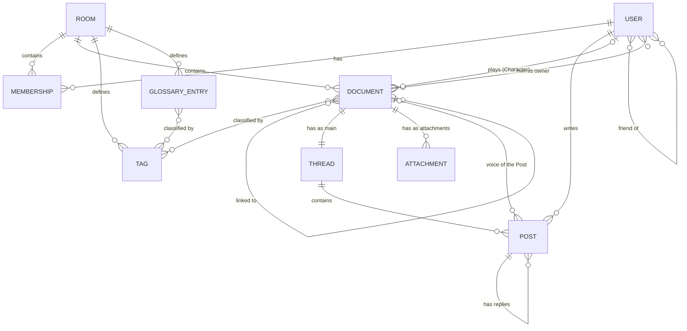

# Collaborative TTRPG notes platform — Requirements analysis

| | |
|---|---|
| **Version** | 0.4 (draft) |
| **Date** | 1 October 2026 |
| **Status** | Being defined: requirements, use cases, features and workflows |
| **Audience** | Project team and the Agents that will use this document as their base Context |

**New in 0.2:** resolved Open points OQ-01…OQ-08 (now Decisions D-11…D-18); introduced the Administrator role; a Document's "fields" are now Details in the main Thread; the Glossary can be filtered by Tag; new Open points OQ-09…OQ-12.

**New in 0.3:** resolved Open points OQ-11 and OQ-12 (now Decisions D-19, D-20), ahead of the Documents/Details unit. OQ-09 and OQ-10 stay formally open but are already implemented in practice by the Rooms/Membership unit (see `progress-tracker.md`).

**New in 0.4:** new Decisions D-21…D-27: **PDF Attachments** on Documents, **Characters** linked to a User with Posts written "as the Character", **Friendships** between Users (the first concept not tied to a Room). New rules VR-12, VR-13, requirements FR-D8, FR-D9, FR-T11, FR-F1…FR-F5, use cases UC-20…UC-25, invariants I-12…I-14. Tickets: `context/feature/15`…`18`. The document was also translated from Italian to English; IDs and meaning are unchanged.

---

## 1. Purpose of this document

This document is the project's base guideline. It is used to:

1. fix requirements, use cases, features and workflows before implementation;
2. give the Agents that will work on later implementations a **stable, unambiguous Context**.

**Reading conventions**

- Every item has a **stable ID** (`D-` decisions, `OQ-` open points, `VR-` visibility rules, `FR-` functional requirements, `NFR-` non-functional, `UC-` use cases, `W-` workflows, `I-` invariants). Always refer to the IDs, not to paraphrases.
- Capitalized terms are defined in the Glossary (section 3) and must be used with that meaning.
- Anything not in the Decisions (section 5) is a **proposal**, not a confirmed choice.

---

## 2. Vision and scope

A web application, distributed online, where several Users contribute to the documentation and notes of a campaign of any TTRPG (game-system agnostic).

**Goals**

- Gather a campaign's information in one place (places, NPCs, events, artifacts and more).
- Allow contextual conversations about the content through Threads.
- Control precisely who sees what (the Master's secrets, individual Players' information).
- Produce a structured knowledge base, usable by Agents too.

**Out of scope for now**

- Real-time collaborative editing (D-04).
- Managing rules, character sheets, dice, maps or combat. *(A character sheet can however be **attached** as a PDF file to the Character's Document, D-21: the platform stores it, it doesn't interpret it.)*
- A native mobile app (the web interface must still be usable from a smartphone).

---

## 3. Glossary

| Term | Definition |
|---|---|
| **User** | A person authenticated on the platform (Google login). |
| **Room** | The container of a campaign: it has members, Documents, Tags, a Glossary. |
| **Membership** | The link between a User and a Room, with their roles in that Room. |
| **Master** | A User's role in a specific Room, with full Ownership of the content. |
| **Player** | A User's role in a specific Room, with their own contributions and visibility. |
| **Administrator** | The Room management role (members, roles, invitations). Given to the creator by default; several Users can hold it (D-11). |
| **Document** | A unit of knowledge in a Room (place, NPC, event, artifact, etc.). It has no rigid type (D-05). |
| **Tag** | A label to classify and navigate Documents and Glossary entries. "Types" are Tags (D-05). |
| **Glossary** (or Dictionary) | The Room's set of entries (term + definition), filterable by Tag (D-14). |
| **Thread** | A conversation tied to a Document, made of nested Posts. Every Document has a main Thread. |
| **Post** | A single contribution in a Thread. It can be a **Comment** or a **Detail**. |
| **Detail** | An additional titled Description added to a Document's main Thread (e.g. "Distinguishing marks: has a wooden leg that creaks with every step") (D-18). |
| **Ownership (of a Document)** | The right to edit the Document and manage its visibility. Reassignable (D-12). |
| **Visibility** | The set of Users who can see a piece of content. |
| **Reveal** | An action that widens a piece of content's visibility, with tracking. |
| **Agent** | An automated consumer of context that acts with the permissions of the User it acts for. |
| **Attachment** | A PDF file uploaded to a Document (e.g. a Character's sheet). It has the Document's visibility (D-21). |
| **Character** | A Document played by a member of the Room (its **Character player**), usually a PC. It is a Document like any other, plus the link to its player (D-23). |
| **Character player** | The member of the Room linked to a Character. They can write Posts as that Character (D-24). Not to be confused with the Player role. |
| **Friend** | A User linked to another User by an accepted Friendship, independently of Rooms (D-26). |
| **Friend code** | A personal, regenerable code or link through which a User can receive Friendship requests (D-27). |

---

## 4. Actors and roles

| Actor | Description |
|---|---|
| Visitor | Not authenticated. Sees only the login page. |
| User | Authenticated. Can create Rooms and receive invitations. |
| Administrator | Per-Room role. Manages members, roles and invitations. Given to the creator by default; several Administrators are possible (D-11). |
| Master | Per-Room role. Full Ownership of the content, sees every piece of content in the Room. |
| Player | Per-Room role. Contributes and manages the visibility of their own content. |
| Agent (future) | Acts with a User's scope. |

**Roles depend on the Room** (D-06): the same User can be Master in one Room and Player in another.

*Assumption (OQ-09):* the Administrator role **can be combined** with Master or Player: a User always has at least one narrative role (Master or Player) and can additionally be Administrator. A Room's creator starts as Administrator and Master.

---

## 5. Decisions made

| ID | Decision |
|---|---|
| D-01 | The **Master also sees Players' private content**. Comments that are 100% private (Master included, "sealed content") are a possible evolution but not a priority. |
| D-02 | A Room can have **several Masters (co-GMs)**, not a priority. A general Room management system is needed: Administrator Users, editable roles, Users who join or are invited. |
| D-03 | A **Document's description** is edited by **anyone with Ownership** of that Document. |
| D-04 | **No real-time editing** for now. Priority to an **efficient Thread structure**. |
| D-05 | Documents are **not strictly typed**: "Types" (NPC, Place, Event, Artifact…) are treated as **Tags**. |
| D-06 | Roles (Master/Player/Administrator) are **per Room**, not global. |
| D-07 | Login through **Google** (preferred method). |
| D-08 | Every **Player owns the visibility of their own content** with respect to the other Players. The **Master has full Ownership** of the project (Room). |
| D-09 | Every Document can have a Name, Images, a description, Tags and further details (defined in D-18). |
| D-10 | Content, single comments and other information can be **hidden from different Users**. |
| D-11 | The **Administrator is a third role**, given by default to the Room's creator. **Several Users can be Administrators at the same time.** *(resolves OQ-01)* |
| D-12 | **Document Ownership:** the creator is Owner by default; the Master and Owners can add or remove Owners (Ownership can be reassigned to others). The **Master always has implicit Ownership**. *(resolves OQ-02)* |
| D-13 | **Players can create Documents** by default; the option can be turned off per Room by the Master. *(resolves OQ-03)* |
| D-14 | **Tags with an optional category** (e.g. "Type", "Faction"); default Tags (NPC, Place, Event, Artifact) are created with the Room and editable. The **Glossary/Dictionary can be filtered by one or more Tags**. *(resolves OQ-04)* |
| D-15 | **The content of a User who leaves or is removed stays visible, unless deleted**. Ownership of their Documents can be reassigned; the Master has implicit Ownership anyway. *(resolves OQ-05)* |
| D-16 | The **Administrator can designate a new Master**. **The last Administrator cannot leave** the Room without designating a new Administrator. *(resolves OQ-06)* |
| D-17 | A **reply to a Post cannot be more visible than its parent Post**. *(resolves OQ-07)* |
| D-18 | A **Document's details** are **further Descriptions (Details) added to the Document's main Thread**, each with a title and content. There are no structured custom fields. *(resolves OQ-08)* |
| D-19 | A **Detail** can be added by **any member who sees the Document** (not only by Owners). It is a **top-level Post with a title**, published in the main Thread, with **its own visibility** (like every Post, section 8) and **nested replies**. It is **editable by its author and by the Master** (not by an Owner who is neither of the two). An **Owner can promote it** into the Document's description (FR-T8). *(resolves OQ-11)* |
| D-20 | **One main Thread per Document**: no additional Threads in v1. *(resolves OQ-12)* |
| D-21 | A Document can have **PDF Attachments**. An Attachment **has no visibility of its own**: whoever sees the Document sees it. A secret file goes on a secret Document. |
| D-22 | Attachments are **uploaded and removed by the Document's Owners and the Master** (D-12). Limits: **10 MB per file, 10 Attachments per Document**. The file is validated by its content (not its name) and is always opened or downloaded as a separate file, never embedded in the application's page. |
| D-23 | A Document can be a **Character** linked to **a single** member of the Room (its Character player); a member can have **several Characters**. The link is neither a custom field (I-08) nor a type (D-05): it is a relation, like Ownership. It is set by **the Master or an Owner of the Document**; the Character player doesn't have to confirm. Linking the Character player can also make them an Owner (the proposed default). If the Character player leaves or is removed, the link is dropped and the Document stays (D-15). |
| D-24 | A member can write a Post **as one of their own Characters**. The **Master can write as any Document** of the Room (to give NPCs a voice). The Post still belongs to the User who writes it: edit, delete and visibility permissions don't change. |
| D-25 | A Post written as a Character shows the Character's name and image **only to those who see the Character's Document**; everyone else sees the real author, as with a normal Post (VR-13). |
| D-26 | Users can form **Friendships**, valid across Rooms: request, acceptance or refusal, removal by either side. In v1 a Friendship is used to **invite a Friend directly into a Room**: the invitation stays pending until the Friend accepts it, nobody joins a Room without consenting. Profile privacy tied to Friendships is a later evolution. |
| D-27 | A Friendship request can be sent **only to a member of a shared Room** or through their **Friend code**. There is no search by name or email (it would reveal who has an account). Declining or removing is silent; a declined request cannot be repeated for 30 days. No blocking in v1. |

---

## 6. Open points

| ID | Question | Working proposal |
|---|---|---|
| OQ-09 | Can the **Administrator role be combined** with Master/Player? How are powers split between Administrator and Master (deleting/archiving the Room, designating Administrators)? | Combinable. **Administrator** = Room management (members, roles, invitations, archiving/deletion, designating Masters and Administrators). **Master** = powers over content (D-08). An Administrator who isn't a Master has no extra visibility over content. The creator starts as Administrator + Master. |
| OQ-10 | Can a Room be left **without a Master**? | No: the last Master cannot leave or be demoted without a replacement; the Administrator can designate one (D-16). |

**History of resolved Open points:** OQ-01 → D-11 · OQ-02 → D-12 · OQ-03 → D-13 · OQ-04 → D-14 · OQ-05 → D-15 · OQ-06 → D-16 · OQ-07 → D-17 · OQ-08 → D-18 · OQ-11 → D-19 · OQ-12 → D-20.

*Note: OQ-09 and OQ-10 stay here because they don't have a formal `D-` ID yet, but their working proposals are already implemented (see `progress-tracker.md`, Rooms/Membership unit) — they don't block later units.*

---

## 7. Domain model

```mermaid
erDiagram
    USER ||--o{ MEMBERSHIP : has
    ROOM ||--o{ MEMBERSHIP : contains
    ROOM ||--o{ DOCUMENT : contains
    ROOM ||--o{ TAG : defines
    ROOM ||--o{ GLOSSARY_ENTRY : defines
    DOCUMENT }o--o{ TAG : "classified by"
    GLOSSARY_ENTRY }o--o{ TAG : "classified by"
    DOCUMENT }o--o{ USER : "has as owner"
    DOCUMENT }o--o{ DOCUMENT : "linked to"
    DOCUMENT ||--|| THREAD : "has as main"
    THREAD ||--o{ POST : contains
    POST ||--o{ POST : "has replies"
    USER ||--o{ POST : writes
    DOCUMENT ||--o{ ATTACHMENT : "has as attachments"
    USER |o--o{ DOCUMENT : "plays (Character)"
    DOCUMENT |o--o{ POST : "voice of the Post"
    USER }o--o{ USER : "friend of"
```

**Notes on the model**

- `MEMBERSHIP` holds the User's **roles** in the Room: Master or Player, plus the optional Administrator (D-06, D-11). It is what makes the role depend on the Room.
- `DOCUMENT` **has no "type" field**: classification happens through `TAG` (D-05).
- `DOCUMENT` **has no custom fields**: additional information is `POST`s of kind **Detail** in the main Thread (D-18).
- Every visible piece of content (Document, information block, Post, Glossary entry) has an associated **Visibility rule**.
- `DOCUMENT` ↔ `USER` (owner) represents **Ownership** (D-03, D-12).

**Main entities and indicative attributes**

- **User:** id, Google identity (name, avatar).
- **Room:** id, name, description, game system (free text), status (active/archived).
- **Membership:** user, room, narrative role (Master/Player), Administrator flag, join date.
- **Document:** id, name, images, description, Tags, Owners, visibility, version history; main Thread.
- **Tag:** name, optional category, Room.
- **GlossaryEntry:** term, definition, Tags, visibility, Room.
- **Thread:** owning Document; contains the Posts.
- **Post:** author, kind (Comment | Detail), title (Detail only), content, parent Post, visibility, status, timestamps.
- **Invitation:** Room, code/link, proposed role, expiry, status.
- **AuditLog:** who, what, when (visibility, role and Ownership changes, Reveal, a Character's player).
- **Attachment:** Document, display name, size, type (PDF), who uploaded it, date (D-21, D-22).
- **Document (Character):** optional Character player, a member of the Room (D-23).
- **Post (as a Character):** optional Document that "speaks" in the Post (D-24).
- **Friendship:** pair of Users, who asked, status (pending / accepted), dates (D-26). Belongs to no Room.
- **FriendCode:** User, code, creation date (D-27).

---

## 8. Visibility model

**Levels**

| Level | Who sees it |
|---|---|
| Room | Every member of the Room |
| Master only | Only the Masters |
| Private | The author/Owner and the Master |
| Selective | Author/Owner, Master and a list of chosen Users |

**Rules**

| ID | Rule |
|---|---|
| VR-01 | The **Master sees every piece of content** in the Room, whatever its level (D-01). |
| VR-02 | A **Player decides the visibility of their own content** with respect to the other Players (D-08). |
| VR-03 | Visibility applies to **Documents, Document blocks, Posts (Comments and Details)** (D-10). |
| VR-04 | A **reply cannot be more visible than its parent Post** (D-17). |
| VR-05 | Every Room defines a **default visibility** for new content. |
| VR-06 | **Reveal** widens visibility and is recorded (who, when, from/to which level). |
| VR-07 | The visibility filter is applied **server-side** at every exit point: lists, search, Tag filters, Glossary, counts (Tag counts too), backlinks, notifications, images, export, API and Agent context. |
| VR-08 | Every visibility change is tracked in the AuditLog. |
| VR-09 | *(evolution, not a priority)* **Sealed** content: private from the Master too (D-01). |
| VR-10 | *(proposal)* **Glossary entries** are content with a visibility, so they don't reveal hidden information. |
| VR-11 | The content of a User who leaves stays subject to the visibility that was set (D-15). |
| VR-12 | An **Attachment** has its Document's visibility; there is no visible Attachment on a hidden Document (D-21). |
| VR-13 | A Post written **as a Character** doesn't reveal the Character to those who don't see its Document: for that reader the Post shows the real author (D-25). |

---

## 9. Ownership and permissions

**Ownership of a Document (D-12):** the creator is Owner by default. The Master and Owners can add or remove Owners. The Master is always an implicit Owner. Whoever isn't an Owner contributes through the Thread (Comments and Details).

**How to read the matrix:** the Administrator column shows only the **Room management powers**. Powers over content come from the narrative role (Master/Player) and from Ownership (OQ-09).

| Action | Administrator | Master | Document Owner | Other members | Non-member |
|---|---|---|---|---|---|
| Edit/archive/delete the Room | ✅ | ❌ | — | ❌ | ❌ |
| Invite, remove members, change roles, designate Masters and Administrators | ✅ | ❌ | — | ❌ | ❌ |
| Create Documents | — | ✅ | — | ✅ (D-13) | ❌ |
| Edit a Document's description | — | ✅ | ✅ | ❌ | ❌ |
| Reassign Ownership | — | ✅ | ✅ | ❌ | ❌ |
| Manage Tags and Glossary | ✅ | ✅ | ❌ | ❌ | ❌ |
| Post Comments and add Details (where visible) | — | ✅ | ✅ | ✅ | ❌ |
| Set the visibility of one's own content | — | ✅ | ✅ | ✅ | ❌ |
| See others' non-public content | ❌ | ✅ | Only if allowed | Only if allowed | ❌ |
| Moderate or delete others' Posts | — | ✅ | ❌ | ❌ | ❌ |
| Reveal others' content | — | ✅ | ❌ | ❌ | ❌ |
| Upload or remove PDF Attachments (D-22) | — | ✅ | ✅ | ❌ | ❌ |
| Link a Character to its Character player (D-23) | — | ✅ | ✅ | ❌ | ❌ |
| Write as a Character (D-24) | — | ✅ (any Document) | Only if Character player | Only if Character player | ❌ |
| Invite a Friend directly into the Room (D-26) | ✅ | ❌ | — | ❌ | ❌ |

*The matrix is a proposal to validate together with OQ-09; the part about Details is now confirmed by D-19.*

---

## 10. Functional requirements

### Authentication
- **FR-A1** Login with Google (OAuth), Discord, Facebook, GitHub and X.
- **FR-A2** Basic profile (name, avatar) and logout.

### Rooms and members
- **FR-R1** Create, edit, archive and delete a Room. Whoever creates the Room becomes Administrator (D-11) and Master (OQ-09).
- **FR-R2** Invite through a link or code, with expiry and revocation.
- **FR-R3** Accept an invitation and join with the proposed role.
- **FR-R4** Manage members: change roles, give the Administrator role to several Users, remove, leave (D-02, D-11).
- **FR-R5** Designate a new Master (D-16). Several Masters at once (co-GM) are possible but not a priority (D-02).
- **FR-R6** List of one's own Rooms with the roles in each.
- **FR-R7** The last Administrator cannot leave without designating a new Administrator (D-16).
- **FR-R8** When a User is removed or leaves, their content stays visible unless deleted, and the Ownership of their Documents can be reassigned (D-15).

### Documents
- **FR-D1** Document CRUD with name, images, description (rich text or Markdown), Tags.
- **FR-D2** Management and reassignment of the Document's Ownership (D-12).
- **FR-D3** Add **Details** (further titled Descriptions) to the Document's main Thread (D-18, D-19).
- **FR-D4** Links between Documents through mentions, with backlinks.
- **FR-D5** Change history with restore.
- **FR-D6** Draft/published status.
- **FR-D7** Per-Room option that enables/disables Document creation by Players (D-13).
- **FR-D8** **PDF Attachments** on a Document: upload, list, open, download, remove (D-21, D-22). Deleting a Document or a Room also deletes its Attachments.
- **FR-D9** Link a Document to a member as a **Character**, change or remove the Character player (D-23), tracked in the AuditLog.

### Tags, Glossary and navigation
- **FR-N1** Per-Room Tags, with an optional category and default Tags on creation (D-14).
- **FR-N2** Filter Documents by one or more (combinable) Tags and navigate by category.
- **FR-N3** Glossary with entries, definitions, Tags and links to related Documents.
- **FR-N4** **Filter the Glossary/Dictionary by one or more Tags** (D-14).
- **FR-N5** Full-text search over Documents, Posts and Glossary, always filtered by visibility.
- **FR-N6** Recognize Glossary terms in text (Could).

### Threads
- **FR-T1** Every Document has a main Thread; Comments and Details are added as Posts, with nested replies.
- **FR-T2** Limited nesting depth (proposal: 3–4 levels, then flattening) to keep it readable.
- **FR-T3** Sorting (chronological, latest activity) and progressive/paginated loading.
- **FR-T4** Collapse/expand branches; unread-content indicator.
- **FR-T5** Edit and delete one's own Posts (deletion with a placeholder so the conversation isn't broken); the Master can moderate.
- **FR-T6** @User mentions and reactions.
- **FR-T7** Pin a Post and mark a discussion as resolved.
- **FR-T8** **Promote** a Post or a Detail into the Document's description (or into a new Document), by an Owner.
- **FR-T9** In-app notifications (email later).
- **FR-T10** Details are shown on the Document card as a dedicated section, filtered by visibility.
- **FR-T11** Write a Post **as a Character** (D-24), shown according to VR-13.

### Visibility
- **FR-V1** Set the visibility of a Document, block and Post (VR-03).
- **FR-V2** **Reveal** action with tracking (VR-06).
- **FR-V3** "View as User X" preview for the Master.
- **FR-V4** Server-side visibility filter on every query (VR-07).
- **FR-V5** History of visibility changes (VR-08).
- **FR-V6** A reply cannot have a wider visibility than its parent Post (VR-04).

### Friendships
- **FR-F1** Send a Friendship request to a member of a shared Room or through a Friend code (D-27).
- **FR-F2** Accept, decline or cancel a request; remove a Friend (D-26).
- **FR-F3** List of Friends and of received and sent requests on the Account page.
- **FR-F4** Personal Friend code, copyable and regenerable (D-27).
- **FR-F5** Invite a Friend directly into a Room with a proposed role; the invitation becomes a Membership only when the Friend accepts it (D-26, FR-R3).

### Agent integration
- **FR-G1** Structured export of the Room (JSON/Markdown) with stable IDs, Tags, links between Documents, Details and Thread structure.
- **FR-G2** API access with the requesting User's scope.

---

## 11. Non-functional requirements

- **NFR-01 Security:** visibility is enforced server-side; the UI is never the only barrier.
- **NFR-02 Isolation:** no access to data of Rooms the User isn't a member of.
- **NFR-03 Privacy:** from Google's data only identity and avatar are used. A Friend sees the same profile data that members of a shared Room see, no more (D-26).
- **NFR-04 Performance:** lists, search and Threads must stay smooth with a lot of content and active visibility filters.
- **NFR-05 Usability:** the interface is usable from a smartphone during game sessions.
- **NFR-06 Traceability:** roles, ownership and visibility have an AuditLog.
- **NFR-07 Reliability:** backups and version history.
- **NFR-08 Extensibility:** a data model agnostic of the game system and of Document "types".

---

## 12. Use cases

| ID | Use case | Actor | Preconditions | Main flow | Alternatives / exceptions |
|---|---|---|---|---|---|
| UC-01 | Login | Visitor | — | Chooses "Sign in with Google" → authorizes → gets in | Authorization denied: stays on the login page |
| UC-02 | Create a Room | User | Authenticated | Enters name and game system → the Room is created → the User becomes Administrator and Master → the default Tags are created | Missing name: validation error |
| UC-03 | Invite into a Room | Administrator | Administrator role | Generates a link/code with a proposed role and expiry → shares it | Revoking the invitation; expired invitation |
| UC-04 | Join a Room | User | Valid invitation | Opens the link → logs in → is added with the proposed role | Invalid/expired invitation; already a member |
| UC-05 | Manage members and roles | Administrator | Administrator role | Changes roles, appoints Administrators, designates a new Master, removes a member | Removing/demoting the last Master or Administrator without a replacement: not allowed (D-16, OQ-10) |
| UC-06 | Create a Document | Master/enabled Player | Member of the Room | Enters name, description, images, Tags → sets the visibility → saves; becomes Owner | Document creation by Players disabled (D-13) |
| UC-07 | Edit a Document | Owner | Owner of the Document | Edits the description → saves → new version in the history | Not an Owner: can only post in the Thread |
| UC-08 | Reassign Ownership | Master/Owner | Permission | Adds or removes Owners of the Document | The last explicit Owner can't be removed leaving only the implicit Master |
| UC-09 | Browse by Tag | Member | Member of the Room | Selects one or more Tags → sees the visible Documents with those Tags | No visible result |
| UC-10 | Consult the Glossary | Member | Member of the Room | Opens the Glossary → filters by one or more Tags or searches → sees definition and linked Documents | Term missing |
| UC-11 | Start/reply in a Thread | Member | Visible Document | Writes a Comment or replies to a Post → sets the visibility → publishes | Parent not visible: replying isn't possible |
| UC-12 | Set visibility | Author/Owner | Own content | Chooses the level (or the Users) → saves → the AuditLog records it | Reply more visible than its parent: refused (VR-04) |
| UC-13 | Reveal content | Master | Content with limited visibility | Selects "Reveal" → chooses the new audience → confirms → the Users involved are notified | Cancel before confirming |
| UC-14 | View as another User | Master | Master role | Chooses a User → sees the Room with their visibility | — |
| UC-15 | Search | Member | Member of the Room | Enters a query → sees only the visible results | No result |
| UC-16 | Promote a Post | Document Owner | Post visible to the Owner | Chooses "Promote" → merges it into the description or creates a new Document → the Post stays as a reference | Visibility of the promoted content to be confirmed |
| UC-17 | Export context for an Agent | Agent on behalf of a User | The User's scope | Requests the export → receives only the content visible to that User | Invalid scope: refused |
| UC-18 | Add a Detail | Member | Visible Document | Opens the Document → "Add Detail" → enters a title (e.g. "Distinguishing marks") and content → sets the visibility → publishes in the main Thread | Missing title or content: validation |
| UC-19 | Leave the Room | Member | Member of the Room | Confirms leaving → their content stays (D-15) → the Ownership of their Documents stays reassignable | Last Administrator or last Master without a replacement: not allowed (D-16) |
| UC-20 | Attach a PDF | Owner / Master | Document they own | Opens the Document → "Upload PDF" → chooses the file → the Attachment appears in the Files section | File not a PDF or over the limits (D-22): refused |
| UC-21 | Link a Character | Master / Owner | Visible Document, Character player is a member of the Room | Opens the Document → "Played by" → chooses the member (and, optionally, makes them an Owner) → saves; the AuditLog records it | Invalid member: refused |
| UC-22 | Write as a Character | Character player / Master | Own Character (or any Document for the Master) | In the Thread chooses "Write as" → the Character → publishes | Not one's own Character: refused (D-24) |
| UC-23 | Ask for Friendship | User | Shared Room or Friend code | Chooses "Add as Friend" or enters the Code → sends the request | Already Friends or request pending; request declined less than 30 days ago |
| UC-24 | Answer a request | User | Request received | Accepts or declines | — |
| UC-25 | Invite a Friend into a Room | Administrator | Administrator role, accepted Friendship | Chooses the Friend and the role → the Friend receives the invitation → accepts it and joins | The Friend declines or lets the invitation expire |

---

## 13. Workflows

**W-01 · Creating a Room and Players joining**
1. The User logs in with Google (UC-01).
2. Creates the Room (UC-02) and becomes Administrator and Master.
3. Generates an invitation (UC-03) and shares it.
4. The Players open the link, log in and join with the Player role (UC-04).

**W-02 · The Master prepares secret content and reveals it**
1. The Master creates a Document (UC-06) with the "NPC" Tag.
2. Sets its visibility to "Master only" (UC-12).
3. During the session uses **Reveal** (UC-13): the content becomes visible to the Room and the Users are notified.

**W-03 · A Player's contribution to a Document**
1. The Player opens the Document of a Place or an NPC.
2. Adds a **Detail** (UC-18), for example "Distinguishing marks: has a wooden leg that creaks with every step", or writes a Comment (UC-11), setting the visibility (e.g. only them and the Master).
3. The Master replies; an Owner of the Document can **promote** the Post into the description (UC-16).

**W-04 · Consultation**
1. The User enters the Room.
2. Filters by Tag (UC-09), consults the Glossary filtering by Tag (UC-10) or searches (UC-15).
3. The system shows only what roles, Ownership and visibility rules allow.

**W-05 · Room management**
1. The Administrator opens member management (UC-05).
2. Changes roles, appoints other Administrators, designates a new Master, invites or removes Users.
3. A member who leaves (UC-19) leaves their content in the Room; the Ownership of their Documents is reassigned to another User (D-15).
4. The changes are recorded in the AuditLog.

**W-06 · An Agent consuming the context**
1. A User starts an Agent on their Room.
2. The Agent requests the export (UC-17) with that User's scope.
3. It receives only the content visible to that User, with stable IDs and links.

---

## 14. Priorities (MoSCoW)

| Priority | Features |
|---|---|
| **Must (MVP)** | FR-A1, FR-A2; FR-R1–R4, FR-R6, FR-R7; FR-D1–D4, FR-D7; FR-N1, FR-N2; FR-T1–T5; FR-V1, FR-V4, FR-V6; NFR-01, NFR-02 |
| **Should** | FR-R5, FR-R8; FR-D5, FR-D8, FR-D9; FR-N3–N5; FR-T6–T8, FR-T10, FR-T11; FR-V2, FR-V3, FR-V5; FR-G1 |
| **Could** | Several co-Masters (D-02); FR-D6; FR-N6; FR-T9; FR-F1–F5; FR-G2; VR-09 (sealed content) |
| **Won't (for now)** | Real-time editing; native mobile app; support for other login providers |

---

## 15. Guidelines for Agents

**Invariants (non-negotiable)**

| ID | Invariant |
|---|---|
| I-01 | An Agent **never exposes** content beyond the visibility of the User it acts for (VR-07). |
| I-02 | **Roles are per Room**: never assume a global role for a User (D-06). |
| I-03 | The **Master sees everything** in their own Room (D-01). |
| I-04 | Documents **have no rigid type**: classification is through Tags (D-05). |
| I-05 | Editing a Document's description belongs to whoever has **Ownership** of it; the Master always has implicit Ownership (D-03, D-12). |
| I-06 | No real-time functionality is required (D-04). |
| I-07 | The **Administrator is a distinct role**; the last Administrator cannot leave without designating a successor (D-11, D-16). |
| I-08 | Documents **have no custom fields**: additional information is **Details** in the main Thread (D-18). |
| I-09 | A reply is never more visible than its parent Post (D-17). |
| I-10 | A **Detail** can be edited only by its author or by the Master; any member who sees the Document can add a new one (D-19). |
| I-11 | A Document has **a single Thread** (the main one) — no additional Threads (D-20). |
| I-12 | An **Attachment** is never visible to someone who doesn't see its Document (D-21, VR-12). |
| I-13 | A Post **as a Character** never reveals a Character hidden from the reader; only the Character player (or the Master) can write as that Character (D-24, D-25, VR-13). |
| I-14 | **Friendships grant no access** to any Room or content: one joins a Room only by accepting an invitation (D-26). |

**Behavior when something is ambiguous**

- If something isn't covered by the Decisions (section 5), check the Open points (section 6) and **don't invent** a rule: flag the ambiguity and propose an option.
- The proposals marked as such (permission matrix, OQ-09…OQ-10, VR-10, Thread depth) are provisional.
- Always cite the IDs (D-, FR-, UC-, VR-…) in answers and derived documents.

---

## 16. Next steps

1. Resolve Open points OQ-09…OQ-10.
2. Validate the permission matrix (section 9) and the visibility model (section 8) with edge cases.
3. Define user stories with acceptance criteria starting from the use cases.
4. Define the Thread structure in detail (depth, sorting, status) and how Details are presented on the Document card.
5. Only after that: architecture, technology stack and detailed data model.
